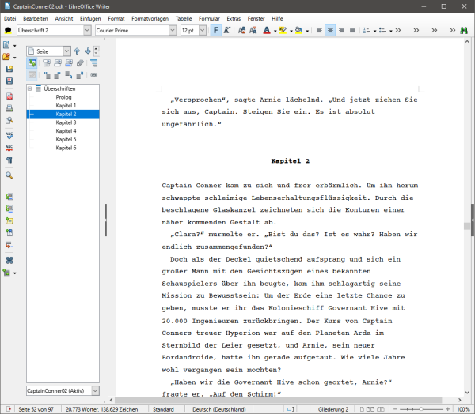
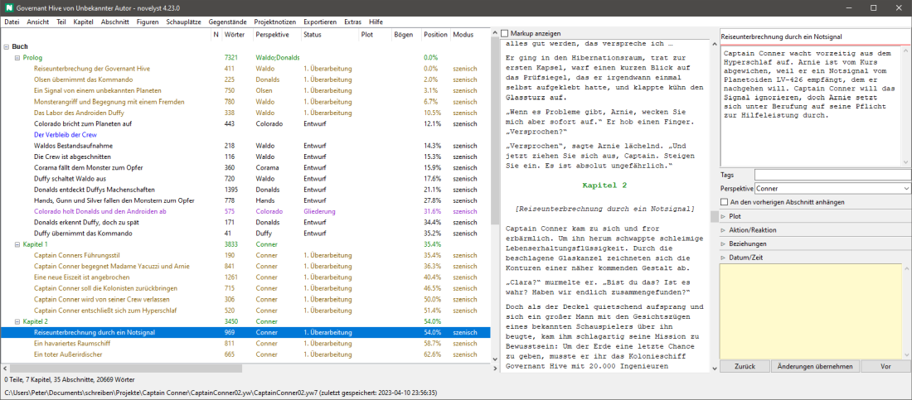
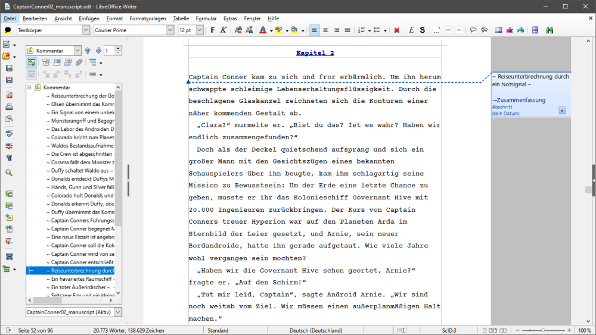
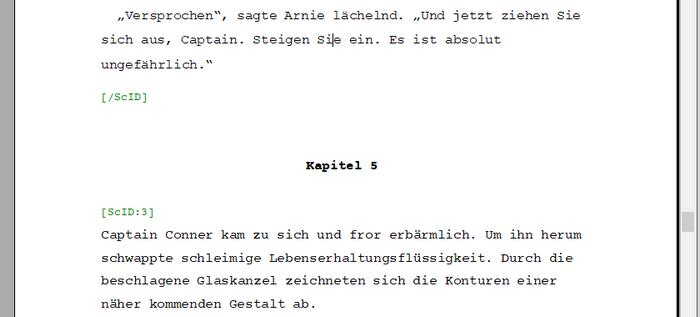

[Projekt-Homepage](https://peter88213.github.io/novelyst) > Einführung

--- 

# novelyst - Einführung

**BITTE BEACHTEN:** Dieses Programm wurde durch [novelibre](https://github.com/peter88213/novelibre) ersetzt, das einen anderen Arbeitsablauf unterstützt und viele [Verbesserungen](https://github.com/peter88213/novelibre/discussions/2) mitbringt. 

[novelyst](https://peter88213.github.io/novelyst/) ist ein Organisationswerkzeug für das Romanschreiben mit *LibreOffice Writer* oder *OpenOffice Writer*. Es ist in Python geschrieben und sollte auf unterschiedlichen Betriebssystemen laufen, für die *Python* verfügbar ist, und zwar mindestens in der Version 3.6. Getestet wurde *novelyst* bisher unter Windows (Vista, 7 und 10), sowie unter Linux (Xubuntu). 

Der folgende Artikel gibt einen kurzen Einblick in die Arbeitsweise mit *novelyst*. 

## Warum novelyst?

*LibreOffice Writer* ein durchdachtes, ausgereiftes und überaus leistungsfähiges Textverarbeitungsprogramm. Über Makroprogrammierung und Erweiterungen gibt es eine enorme Funktionsvielfalt und für viele Probleme eine Lösung. Dazu kommt ein logisch aufgebautes System von Format- und Dokumentenvorlagen. LibreOffice kann Dokumente drucken, in eine Vielzahl von Dateiformaten exportieren, PDF-Druckvorlagen in guter Qualität erzeugen und E-Books erstellen. 

Der *Navigator* von LibreOffice verschafft uns einen groben Überblick über die Dokumentstruktur auf Teile- und Kapitelebene (*Überschrift 1* und *Überschrift 2*).

Was dem Office-Programm fehlt, ist eine kleinteilige Organisation von Metadaten für den Überblick über den Roman, so wie es spezialisierte Autorensoftware bietet. 

Was sind Metadaten? Wenn wir unseren Roman in Teile, Kapitel und Abschnitte unterteilen, können wir zum Beispiel für jede dieser Ebenen zusammenfassende Beschreibungen anlegen. Damit erhalten wir Inhaltsangaben auf Teil- Kapitel- und Abschnittsebene. 

- Wir können uns über die Wortanzahl einen Überblick über die Länge von Teilen, Kapiteln und Abschnitten verschaffen.
- Wir können zu jedem Abschnitt Datum und Zeit der Handlung angeben.
- Wir können Abschnitte mit Figuren, Handlungsorten oder Gegenständen verknüpfen.
- Wir können die innere Handlungsstruktur von Abschnitten planen und erklären.
- Wir können Abschnitte mit Markierungen zum Grad der Fertigstellung versehen,
- und mit Informationen zur Funktion des Abschnitts in der Geschichte,
- und wir können Abschnitten Notizen anhängen.
- Wir können die Erzählperspektive eines Abschnitts angeben.
- Und noch einiges mehr.

All das kann uns entweder im Vornherein bei der Planung, oder im Nachhinein bei der Überarbeitung von umfangreichen Romanen helfen. Und dazu ist *novelyst* gut. 

*novelyst* zeigt uns die Dokumentstruktur bis auf die Ebene der Abschnitte, zusammen mit den Metadaten.

*novelyst* ordnet den Roman mit einer Baumstruktur. Wir können Teile, Kapitel und Abschnitte erzeugen, verschieben und löschen. Teile lassen sich in Kapitel umwandeln und umgekehrt. Einzelne Teile, Kapitel und Abschnitte können als "unbenutzt" markiert, also ausgeblendet werden. Dann tragen sie nicht zur Wortzählung bei und erscheinen nicht im exportierten Manuskript.

## Warum LibreOffice?

In seiner Grundausstattung dient *novelyst* also dazu, die Romanstruktur zu erzeugen, zu verändern und zu beschreiben. Es speichert den kompletten Roman mitsamt den Metadaten und weiteren Daten für die Recherche (z.B. Figuren- und Schauplatzbeschreibungen) in einer einzigen Datei mit der Endung *yw7*. 

Es gibt einen [Texteditor als Zubehör](https://peter88213.github.io/novelyst_editor/) ("Plugin"), mit dem sich die Abschnitte bearbeiten lassen. Mit diesem Plugin könnten wir *novelyst* auch als eigenständiges Autorenprogramm einsetzen, wie z.B. *yWriter* oder *Scrivener*. Dafür ist *novelyst* jedoch nicht gedacht, denn der Texteditor ist dazu einfach zu primitiv: Er hat keine Suchfunktion, keine Rechtschreibkontrolle und bietet nur eingeschränkte Bearbeitungsmöglichkeiten. Er dient dazu, auf die Schnelle mal einen Tippfehler zu korrigieren, oder auch einen "Wordsprint" zu machen, bei dem es nicht auf die Rechtschreibung ankommt.

Halten wir also fest, dass *novelyst* eine Ergänzung für *LibreOffice* oder *OpenOffice* sein soll. Um den maximalen Nutzen daraus zu ziehen, sollten wir uns mit dieser Textverarbeitungssoftware auskennen. Das ist nicht schwer, denn diese Office-Programme sind sehr gut dokumentiert, und es gibt Tutorials und Hilfe im Web. 

Es lohnt sich auf jeden Fall, wenn wir uns mit Formatvorlagen und Dokumentvorlagen vertraut machen, denn dieses Konzept wird auch von *novelyst* unterstützt. Damit ist es relativ leicht, zum Schluss ein ansehnliches Druckergebnis zu erzielen. 

Es empfiehlt sich auch, neben der unverzichtbaren [yw-cnv](https://peter88213.github.io/yw-cnv/)-Erweiterung einige Zusatzwerkzeuge wie [curly](https://peter88213.github.io/curly/), [StyleSwitcher](https://peter88213.github.io/StyleSwitcher/) und [emph](https://peter88213.github.io/emph/) zu installieren. 

---

## Ein Bearbeitungszyklus

Für das komfortable Schreiben, und noch mehr für die ordentliche Gestaltung und die Druckausgabe des Romantexts wollen wir deshalb LibreOffice verwenden. Dazu exportieren wir den Roman zunächst als Manuskript aus *novelyst*. 

Beim Export erzeugt *novelyst* am Beginn jedes Abschnitts einen Kommentar mit dem Abschnittstitel. Auf diese Weise können wir mit dem Navigator zu den Abschnitten springen. Das funktioniert auch bei ausgeschalteter Kommentar-Anzeige.

Wir schreiben die Abschnitte nach der Bearbeitung wieder in die *yw7*-Projektdatei zurück.

Ist *novelyst* zu diesem Zeitpunkt offen, laden wir einfach das Projekt neu, um die Änderungen zu sehen.

Das *odt*-Manuskript wird danach nicht mehr gebraucht. Es kann gelöscht oder beim nächsten Export aus *novelyst* überschrieben werden. 

---

## Ein kurzer Blick unter die Motorhaube

Dies alles funktioniert deshalb, weil *novelyst* das erzeugte *odt*-Manuskript in *Bereiche* aufteilt, mit deren Hilfe die Teile, Kapitel und Abschnitte beim Zurückschreiben in das *yw7*-Format identifiziert und richtig einsortiert werden können. 

Obwohl wir diese Bereichsstruktur mit LibreOffice bearbeiten könnten, sollten wir das auf keinen Fall tun, weil sonst das Zurückschreiben zu *novelyst* eventuell nicht mehr richtig funktioniert. Wir schreiben innerhalb der vorgegebenen Bereiche (die erkennbar sind, wenn man *LibreOffice* die Textbegrenzungen anzeigen lässt) an unseren Abschnitten. 

---

## Mit der Textverarbeitung die Struktur erweitern

Was aber, wenn wir ein neues Kapitel oder einen neuen Abschnitt brauchen? Müssen wir dazu jedesmal zu *novelyst* wechseln? 

Nein, es ist möglich, existierende Abschnitte zu teilen, indem wir einfach eine neue Überschrift einfügen (Teil oder Kapitel), oder eine neue Zeile mit einer speziellen Markierung beginnen (`###` für einen neuen Abschnitt). Beim nächsten Export von *LibreOffice Writer* zu *yw7* wird die Romanstruktur dann automatisch erweitert. Auf diese Weise kann man große Romanpassagen mit der Textverarbeitung schreiben, ohne ständig zu *novelyst* zurückgehen zu müssen. *novelyst* sperrt das Projekt in der Zwischenzeit gegen Bearbeitung, damit der Roman nicht versehentlich in zwei unterschiedlichen Programmen zur selben Zeit geändert wird. 

Was mit *LibreOffice Writer* nicht geht: Teile, Kapitel oder Abschnitte löschen oder verschieben. Derartige Änderungen sind zwar machbar, wirken sich aber beim Zurückschreiben ins *yw7*-Format nicht aus. 

---

## Ausflüge in fremde Welten

Angenommen, wir wollen unser Manuskript jemandem zum Korrigieren geben, der ein fremdes Textverarbeitungsprogramm, z.B. *Word* verwendet. Das ist zunächst kein Problem, weil *LibreOffice* auch das *docx*-Format lesen und schreiben kann. Wenn wir allerdings unser normales Manuskript konvertieren würden, könnte das die Bereichseinteilung beeinflussen, und wir können das bearbeitete Dokument nicht mehr ins *yw7*-Format zurückschreiben. Für diesen Fall gibt es das *Manuskript mit sichtbaren Markierungen*, welche die Umwandlung in andere Dateiformate und zurück nach *odt* überstehen, sofern man sie nicht von Hand verändert oder löscht. 

So sieht das Dokument in _LibreOffice Writer_ aus:

Die farbig hervorgehobenen Zeilen mit den Codes in eckigen Klammern dürfen nicht angerührt werden, wollen wir Änderungen am Text zu *novelyst* zurückschreiben. Ansonsten können wir den Text aber frei bearbeiten und sogar neue Abschnitte einfügen, wie oben beschrieben. Neue Teile oder Kapitel können auch per *Markdown*-Überschrift (Ein oder zwei vorangestellte Rautenzeichen `#`) eingefügt werden.  

Damit ist es nun möglich, zwischendurch eine Online-Textverarbeitung wie *Google Docs* einzusetzen. Nach dem Upload können wir das Dokument online bearbeiten:

Nach dem Download als *.odt* verschieben wir das Dokument aus dem Download-Ordner in den Projektordner, wo die *.yw7*-Projektdatei liegt. Dann können wir die Änderungen in das Projekt übernehmen, entweder mit *LibreOffice/yw-cnv* oder mit [yw2OO](https://peter88213.github.io/yW2OO/). 

---

## Der Roman ist fertig, was nun?

Den fertigen Roman exportieren wir als *Manuskript ohne Markierungen*. 

Damit erhalten wir ein *odt*-Dokument ohne die oben beschriebene Bereichseinteilung. Dieses Dokument lässt sich nicht mehr ins *yw7*-Format zurückschreiben, dafür ist es aber einfacher, es umzuformatieren oder in andere Dateiformate zu exportieren. Wir können jetzt zum Beispiel eine Dokumentvorlage für den Buchdruck anwenden. Oder wir können den Romantext in ein Masterdokument einbetten, das Titelei, Impressum und Inhaltsverzeichnis enthält. 

Wer ein Buch mit dem DTP-Programm *QuarkXpress* setzen möchte, kann die Kapitel mit einem [Hilfsprogramm](https://peter88213.github.io/yw2xtg/) direkt aus der *yw7*-Datei heraus in ein geeignetes Austauschformat umwandeln. 

