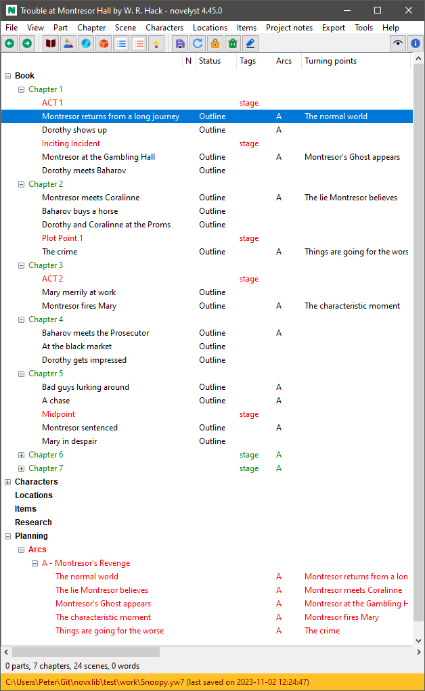
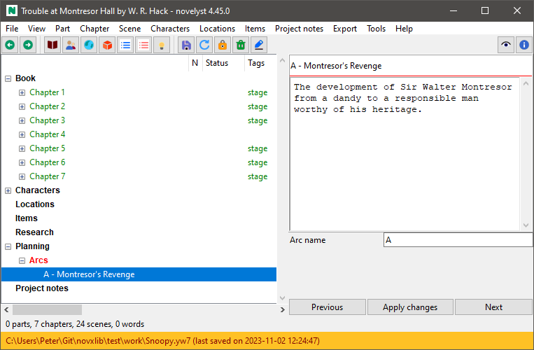
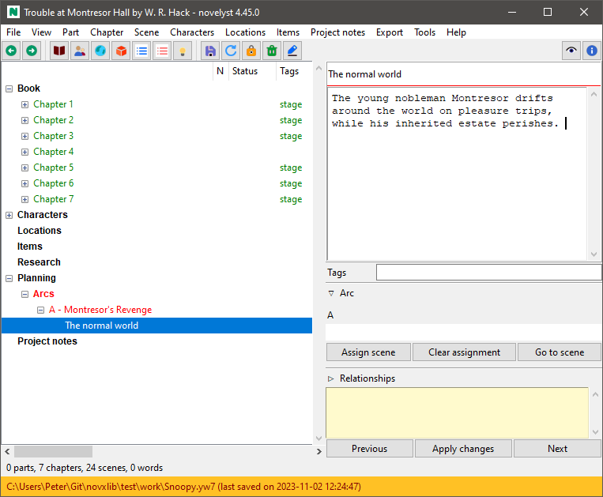

[Project homepage](../index) > [Instructions for use](../usage) > [Online help](help) > Plot

--- 

# Plot

## Applying a story structure model

If you want to divide a story into stages according to a structure model (e.g. the *Three Act Model*, 
or the *Save The Cat* beatsheet), just insert empty "todo" type scenes between the regular scenes 
at the beginning of each stage, and tag them "stage". This gives you color-coded subheadings in the tree view. 

With the [novelyst_templates plugin](https://peter88213.github.io/novelyst_templates/) you can
load pre-made story structure models from Markdown template files, and you can save the 
story structure of your project for reuse.

## Defining Arcs

*novelyst* provides *arcs* as a powerful and flexible concept for plotting.

"Arc" can mean a variety of things: Narrative strand, thread, character arc, storyline, sequence of cause and effect, sequence of setup and payoff, and so on. You can think of an arc as a line on which turning points are arranged that characterize the progression of the story. These turning points can be assigned to scenes to indicate the scene's relevance to the plot. 

- *novelyst* lets you define any number of arcs. 
- Any number of scenes can be assigned to each arc. 
- Any number of arcs can be assigned to each scene.
- Each arc can contain any number of turning points. 
- Each turning point can be assigned to exactly one scene. 

The association of scenes and turning points is shown in the "Plot" column of the tree view.

## How to define arcs

*novelyst* implements arcs as "Todo" type chapters with an **Arc name** entry field. 

1. Create a chapter.
2. Change the chapter's type to "Todo".
3. Give the chapter a descriptive title.
4. In the right pane, type the arc's name into the **Arc name** entry. This will prefix the chapter title with the arc name. It is advised to use short arc names, for instance "A", "B", "C" for storylines, or initial letters for character arcs, etc.

**Note:** If you open a project that was created with a novelyst version older than 4.4 and that contains scenes with assignments of undefined arcs, a new part named **Arcs**, containing the arc-defining chapters, is created automatically in the **Planning** branch. 

## How to group arcs

"Arc" chapters can be placed anywhere in the story. However, It is recommended to put them into "Todo" type parts, so they appear in *novelyst's* "Planning" branch. You can either create one part, called e.g. "Narrative arcs", or create any number of parts, e.g. one for character arcs, and one for setup/payoff sequences, and so on.

## How to assign scenes to arcs

1. Select the scene you want to assign to an arc. This can be any "normal" type scene. 
2. Make sure the **Plot** window is open in the right pane. 
3. In the **Arcs** field, enter the name of the arc you want the scene assign to. You can enter multiple arcs, delimiting them with semicolons. 

**Note:** You can copy/paste long arc names from the defining chapters. A more convenient way to assign scenes to arcs is using the [novelyst_matrix](https://peter88213.github.io/novelyst_matrix/) plugin.

**2nd Note:** This might change in the future. 

## How to disconnect scenes from arcs

1. Select the scene you want to assign to an arc. This can be any "normal" type scene. 
2. Make sure the **Plot** window is open in the right pane. 
3. In the **Arcs** field, remove the name of the arc you want to disconnect. Also remove the corresponding semicolon. 

**Note:** Disconnecting a scene from an arc will also disconnect the corresponding turning points.

## How to delete arcs

1. Select the "Todo" chapter defining the arc you want to remove. 
2. Delete the selected chapter. Children (turning points) are moved to the "Trash" chapter. 

## How to rename arcs

1. Select the "Todo" chapter defining the arc you want to rename.
2. In the right pane, change the arc's name in the **Arc name** entry field. 
3. After having applied the change, you might want to edit the chapter title, removing the old arc prefix.

## How to create turning points

*novelyst* implements arcs as scenes in "arc" chapters. If you add a scene to an arc defining "Todo" chapter, This scene is automatically assigned to the chapter's arc. 

## How to associate turning points with scenes

1. Select the turning point you want to assign a scene to. 
2. In the right pane, click **Assign scene**. This starts the scene picking mode, where the mouse cursor changes to a "plus" symbol in the tree view. 
3. Select the scene you want to assign to the turning point. Clicking on any tree element ends the scene picking mode. You can finish the scene picking mode pressing the **Esc** key as well.   

## How to clear scene associations

1. Select the turning point you want to clear its scene association. 
2. Click **Clear assignment**. 

**Note** The scene association is also cleared automatically if you clear the scene's corresponding arc assignment.

## How to delete turning points

1. Select the turning point you want to delete.
2. Press the **Del** key and confirm. This clears the scene assignment, if any, and moves the scene to the *Trash" chapter. 

## Modeling causality

You can use arcs to establish named connections between scenes, such as *setup -> payoff*, so you can keep track of this relationship even if the scenes are far away from each other.

