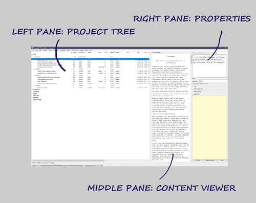

[Project homepage](../index) > [Instructions for use](../usage) > [Online help](help) > Desktop overview

--- 

# Desktop overview

The *novelyst* desktop is divided into three panes:

- The **project tree** in the left pane shows the organization of the project. The **Book** branch contains the parts, chapters, and scenes that belong to the novel manuscript. The **Characters/Locations/Items** branches contain descriptions of the story world's elements that can be associated with the book's scenes. The **Research** branch contains all *Notes* type parts with chapters and scenes intended for the documentation of the story world. The **Planning** branch contains all *Todo* type parts with chapters and scenes intended to build the dramaturgical structure of the story. This is the right place for planning plot points, archetypes, character arcs, and so on. 
- The **Content viewer** in the middle pane shows the part/chapter/scene contents with their titles as headings. The content viewer scrolls automatically to the element selected in the tree view.
- The **Properties** in the right pane show properties/metadata of the element selected in the project tree. 

---

## Project tree operation

### Move parts, chapters, and scenes

Drag and drop while pressing the **Alt** key. Be aware, there is no "Undo" feature. 

---

### Delete parts, chapters, and scenes

Select item and hit the **Del** key.

- When deleting a part, chapter oder scene, the scenes are moved to the _Trash_ chapter at the bottom. 
- The _Trash_ chapter is created automatically, if needed. 
- When deleting the _Trash_ chapter, all scenes are deleted.

- The type of chapters and scenes, as well as the editing status of the scenes are color coded and can be changed via context menu.
- Within chapters, scenes of the same type and with the same viewpoint can be joined.
- "Notes" and "To do" type chapters can be exported to a separate ODT document. 
