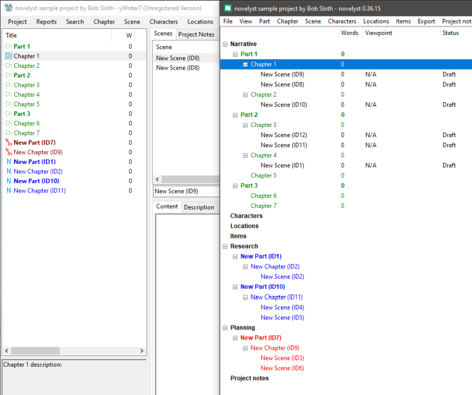

#  novelyst

*novelyst* is an organizer tool for writing novels with *LibreOffice Writer* or *OpenOffice Writer*. The entire novel is stored in a single file with all additional information. The manuscript is exported for editing with *Writer*, and then written back so that everything is always consistent and in one place. *novelyst* uses the file format of [yWriter 7](http://spacejock.com/yWriter7.html) and is largely compatible with it. 

*novelyst* is written in Python and should run on several operating systems.

With the [pywoo extension for OpenOffice](https://peter88213.github.io/pywoo) and the [yw-cnv extension for LibreOffice](https://peter88213.github.io/yw-cnv), you can write your edited Office documents back to the project.

- [Introduction (English)](https://github.com/peter88213/novelyst/wiki/English)
- [Introduction (German)](https://github.com/peter88213/novelyst/wiki/Deutsch)

## Features

- The entire project is displayed in a tree, with branches for the narrative, research, planning, characters, locations, and items.
- Tree elements can be added, moved, and deleted.
- There are three levels: part, chapter, and scene.
- The right sidebar displays the essential properties of the selected element for editing.
- A text viewer window can be toggled on and off.
- There is a wide range of ODF-type file export for *OpenOffice* and *LibreOffice*.
- Several reports can be presented in list form. 
- The application is ready for internationalization with GNU gettext. A German localization is provided. 

## What's the difference to yWriter?

When structuring a novel, *novelyst* builds on the concept of *yWriter*, and extends it in a compatible way. If the appropriate plugin is installed, *yWriter* can even be started with the current project from within the program. Here is a comparison with *yWriter* that illustrates the differences in presentation:

Please note that *novelyst* is not intended to compete with or replace *yWriter*. Quite deliberately, *novelyst* does not support many of *yWriter's* unique features. It has no scene editor included, no progress control, neither LaTeX nor ebook export. Definition and replacement of global variables and project variables is not supported, neither is inline code. Not to mention yWriter's sophisticated backup features. On the other hand, *novelyst* as a Python program can be used on operating systems other than Windows without any problems.

- Besides, in *novelyst* you can assign additional properties to the scenes, for example, the mode (*staged*, *explaining*, *descriptive*, or *summarizing*), or the [arcs](help/arcs), which offer a powerful concept to support plotting. 
- In addition to the *Action/Reaction* scheme, another custom scene category can be defined by the user. 
- The character data categories "Bio" and "Goals" can be renamed.
- *novelyst* can generate a scene's start date/time from the previous scene's end date/time.
- With *novelyst* you can set a document language for spell checking with *OpenOffice/LibreOffice*.
- *novelyst* preserves the markup for foreign language text passages as imported from *OpenOffice/LibreOffice*.
- The necessary data is stored along in the *.yw7* file, without breaking the compatibility to *yWriter*.

## Plugins

*novelyst's* functionality can be extended by plugins. Here are some examples:

- [A button bar](https://peter88213.github.io/novelyst_buttons/)
- [A simple "markup" scene editor](https://peter88213.github.io/novelyst_editor/)
- [A daily progress log viewer](https://peter88213.github.io/novelyst_progress/)
- [A book/series collection manager](https://peter88213.github.io/novelyst_collection/)
- [A relationship matrix](https://peter88213.github.io/novelyst_matrix/)
- [A csv relationship table exporter](https://peter88213.github.io/novelyst_retablex)
- [A Timeline plugin](https://peter88213.github.io/novelyst_timeline/)
- [An Aeon Timeline 2 plugin](https://peter88213.github.io/novelyst_aeon2/)
- [A theme changer](https://peter88213.github.io/novelyst_themes/)
- [A Story Template management plugin](https://peter88213.github.io/novelyst_templates/)

There are some more examples in the release's *add-on* folder, such as a yWriter launcher, a theme changer, or an experimental "dark theme" installer.

## Requirements

- [Python](https://www.python.org/) version 3.6+. 
     - For current Windows versions, use version 3.9.10 or above.
     - For Vista and Windows 7, use version 3.7.2.
- Tk support for Python. This is usually part of the Windows Python installation, but may need to be installed additionally under Linux.
- Either [LibreOffice](https://www.libreoffice.org/) with the [yw-cnv](https://peter88213.github.io/yw-cnv) extension, 
- or [OpenOffice](https://www.openoffice.org) with the [pywoo](https://peter88213.github.io/pywoo) extension.

### Note for Windows users

The easiest way to install Python on your PC may be via the Microsoft store. 

### Note for Linux users

Please make sure that your Python3 installation has the *tkinter* module. On Ubuntu, for example, it is not available out of the box and must be installed via a separate package named *python3-tk*. 

## General note about the fitness for use

At present, this program is still under active development. Therefore it is recommended to check for updates from time to time, as well as for the plugins. 

I use the program myself and fix errors immediately if I notice any. As far as I can tell, *novelyst* runs fast and reliably under Windows and Linux. It should also under other operating systems for which there is a reasonably up-to-date *Python 3* installation. However, there is a lack of a broad user base, which is why one cannot speak of real proven operation. 

The user documentation is a bit sketchy, and I can't promise support either. So if you're curious, the best way is to explore the feature set yourself with a test project.

As it is the case for *yWriter*, *novelyst* applies to an even greater extent that it organizes the text without worrying about formatting and layout issues. For this, users are assumed to have the necessary knowledge of *OpenOffice* or *LibreOffice*.

## Download and install

[Download the latest release (version 4.33.0)](https://raw.githubusercontent.com/peter88213/novelyst/main/dist/novelyst_v4.33.0.zip)

- Extract the "novelyst_v4.33.0" folder from the downloaded zipfile "novelyst_v4.33.0.zip".
- Move into this new folder and open "README.md" for further instructions.
- You may wish to install plugins; the [scene editor](https://peter88213.github.io/novelyst_editor/) is highly recommended.

---

[Changelog](changelog)

[News](https://github.com/peter88213/novelyst/discussions/17)

[Discussions](https://github.com/peter88213/novelyst/discussions)

## Usage

See the [instructions for use](usage)

## Credits

The icons are made using the free *Pusab* font by Ryoichi Tsunekawa, [Flat-it](http://flat-it.com/).

## License

This is Open Source software, and *novelyst* is licensed under GPLv3. See the
[GNU General Public License website](https://www.gnu.org/licenses/gpl-3.0.en.html) for more
details, or consult the [LICENSE](https://github.com/peter88213/novelyst/blob/main/LICENSE) file.
