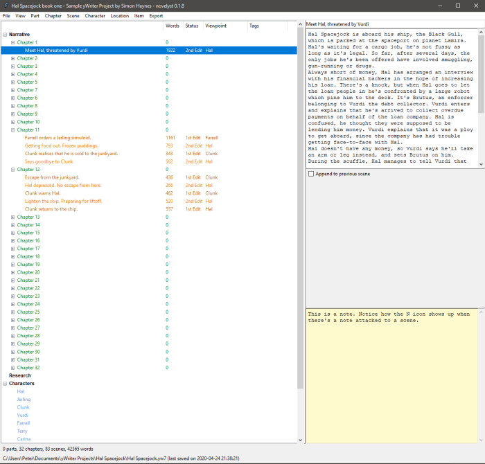

The *novelyst* Python program provides a tree view with parts, chapters and scenes for [yWriter](http://spacejock.com/yWriter7.html) projects. I wrote it for my own use to work on my novels in combination with OpenOffice/LibreOffice. 

With the [pywoo extension for OpenOffice](https://peter88213.github.io/pywoo) and the [yw-cnv extension for LibreOffice](https://peter88213.github.io/yw-cnv), you can write your edited Office documents back to the yWriter project.

Please note that *novelyst* is not intended to compete with or replace yWriter. Quite deliberately, *novelyst* does not support many of yWriter's unique features. It has no scene editor, no progress control, neither LaTeX nor ebook export. Definition and replacement of global variables and project variables is not supported, neither is inline code. Not to mention yWriter's sophisticated backup features.

The purpose of *novelyst* is to allow yWriter projects to be edited quickly and easily with OpenOffice. For this purpose there are the appropriate export functions, the possibility to change the chapter structure (which cannot be done with OpenOffice), and a simple locking mechanism that gives enough freedom so that the user remains responsible for making sure that nothing gets mixed up.

## Features

- *novelyst* reads and writes yWriter 7 project files.
- The entire project is displayed in a tree, with branches for the narrative, characters, locations, and items.
- Chapters marked as "Start of a new section" in yWriter are treated as parts on a higher level. Normal chapters that follow such a chapter are shown as subtree of the part. In this way, parts can be moved or deleted along with their chapters.
- There is also a "Research" branch that contains all the "Notes type" parts. This can be exported to a separate ODT document. 
- The type of chapters and scenes, as well as the editing status of the scenes are color coded and can be changed via context menu.
- *novelyst's* functionality can be extended by plugins, e.g. for [Timeline](https://peter88213.github.io/yw-timeline/) or [Aeon Timeline 2](https://peter88213.github.io/aeon2yw/).

## Requirements

- [Python 3.6+](https://www.python.org). 
- Tk support for Python. This is usually part of the Windows Python installation, but may need to be installed additionally under Linux.

## Download and install

[Download the latest release (version 0.12.0)](https://raw.githubusercontent.com/peter88213/novelyst/main/dist/novelyst_v0.12.0.zip)

- Unzip the downloaded zipfile "novelyst_v0.12.0.zip" into a new folder.
- Move into this new folder and launch **setup.pyw**. This installs the application for the local user.
- Create a shortcut on the desktop when asked.
- Open "README.md" for usage instructions.

### Note for Linux users

Please make sure that your Python3 installation has the *tkinter* module. On Ubuntu, for example, it is not available out of the box and must be installed via a separate package. 

------------------------------------------------------------------

[Changelog](changelog)

## Usage

See the [instructions for use](usage)

## License

novelyst is distributed under the [MIT License](http://www.opensource.org/licenses/mit-license.php).
