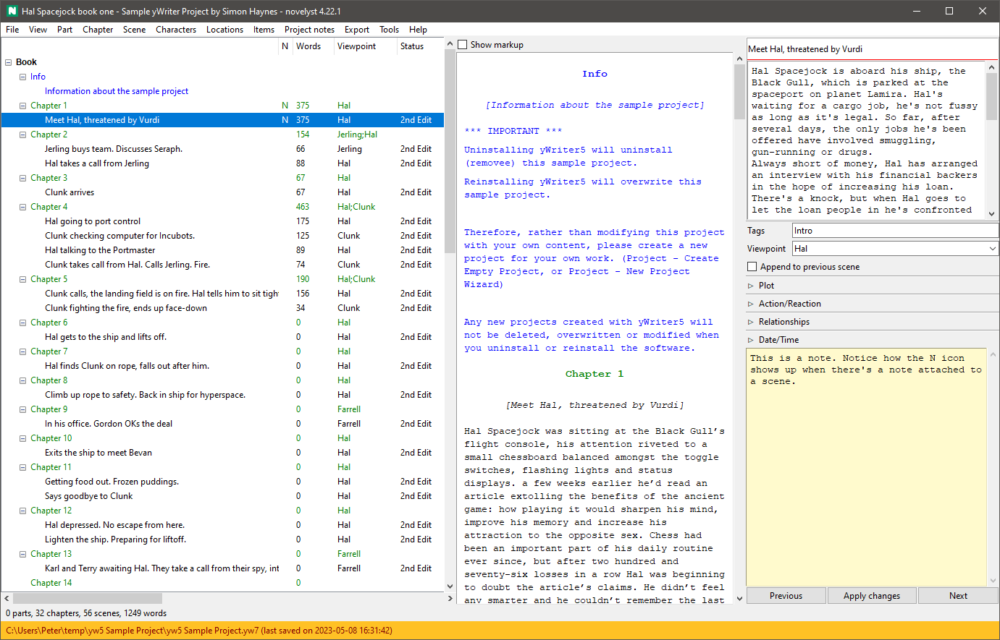

#  novelyst

**NOTE:** This application will not be continued. It is replaced by [novelibre](https://github.com/peter88213/novelibre). 

*novelyst* is an organizer tool for writing novels with *LibreOffice Writer* or *OpenOffice Writer*. The entire novel is stored in a single file with all additional information. The manuscript is exported for editing with *Writer*, and then written back so that everything is always consistent and in one place. *novelyst* uses the file format of [yWriter 7](http://spacejock.com/yWriter7.html) and is largely compatible with it. 

*novelyst* is written in Python and should run on several operating systems.

With the [pywoo extension for OpenOffice](https://peter88213.github.io/pywoo) and the [yw-cnv extension for LibreOffice](https://peter88213.github.io/yw-cnv), you can write your edited Office documents back to the project.

- [Introduction (English)](introduction)
- [Introduction (German)](de/introduction)
- [What's the difference to yWriter?](ywriter)

## Features

- The entire project is displayed in a tree, with branches for the narrative, research, planning, characters, locations, and items.
- Tree elements can be added, moved, and deleted.
- There are three levels: part, chapter, and scene.
- The right sidebar displays the essential properties of the selected element for editing.
- A text viewer window can be toggled on and off.
- There is a wide range of ODF-type file export for *OpenOffice* and *LibreOffice*.
- Several reports can be presented in list form. 
- The application is ready for internationalization with GNU gettext. A German localization is provided. 

## Plugins

*novelyst's* functionality can be extended by plugins. Here are some examples:

- [A button bar](https://peter88213.github.io/novelyst_buttons/)
- [A simple "markup" scene editor](https://peter88213.github.io/novelyst_editor/)
- [An on-demand update checker](https://peter88213.github.io/novelyst_updater/)
- [A daily progress log viewer](https://peter88213.github.io/novelyst_progress/)
- [A book/series collection manager](https://peter88213.github.io/novelyst_collection/)
- [A relationship matrix](https://peter88213.github.io/novelyst_matrix/)
- [A csv relationship table exporter](https://peter88213.github.io/novelyst_retablex)
- [A Timeline plugin](https://peter88213.github.io/novelyst_timeline/)
- [An Aeon Timeline 2 plugin](https://peter88213.github.io/novelyst_aeon2/)
- [A theme changer](https://peter88213.github.io/novelyst_themes/)
- [A Story Template management plugin](https://peter88213.github.io/novelyst_templates/)

There are some more examples in the release's *add-on* folder: a yWriter launcher and a simple theme changer.

## Requirements

- [Python](https://www.python.org/) version 3.6+. 
     - For current Windows versions, use version 3.9.10 or above.
     - For Vista and Windows 7, use version 3.7.2.
- Tk support for Python. This is usually part of the Windows Python installation, but may need to be installed additionally under Linux.
- Either [LibreOffice](https://www.libreoffice.org/) with the [yw-cnv](https://peter88213.github.io/yw-cnv) extension, 
- or [OpenOffice](https://www.openoffice.org) with the [pywoo](https://peter88213.github.io/pywoo) extension.

### Note for Linux users

Please make sure that your Python3 installation has the *tkinter* module. On Ubuntu, for example, it is not available out of the box and must be installed via a separate package named *python3-tk*. 

## Download and install

[Download the latest release (version 4.45.1)](https://github.com/peter88213/novelyst/raw/main/dist/novelyst_v4.45.1.zip)

- Extract the "novelyst_v4.45.1" folder from the downloaded zipfile "novelyst_v4.45.1.zip".
- Move into this new folder and open "README.md" for further instructions.
- You may wish to install plugins; the [scene editor](https://peter88213.github.io/novelyst_editor/) is highly recommended.

---

[Changelog](changelog)

[News](https://github.com/peter88213/novelyst/discussions/17)

[Discussions](https://github.com/peter88213/novelyst/discussions)

## Usage

See the [instructions for use](usage)

## Credits

The icons are made using the free *Pusab* font by Ryoichi Tsunekawa, [Flat-it](http://flat-it.com/).

## License

This is Open Source software, and *novelyst* is licensed under GPLv3. See the
[GNU General Public License website](https://www.gnu.org/licenses/gpl-3.0.en.html) for more
details, or consult the [LICENSE](https://github.com/peter88213/novelyst/blob/main/LICENSE) file.
