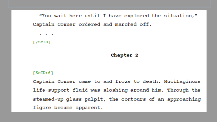

# novelyst - Introduction

**NOTE:** This application is replaced by [novelibre](https://github.com/peter88213/novelibre) which supports another workflow and comes with many [improvements](https://github.com/peter88213/novelibre/discussions/2). 

[novelyst](https://peter88213.github.io/novelyst/) is an organizer tool for novel writing with *LibreOffice Writer* or *OpenOffice Writer*. It is written in Python and should run on different operating systems for which *Python* is available, at least version 3.6. Tested so far *novelyst* on Windows (Vista, 7 and 10), as well as Linux (Xubuntu). 

The following article gives a short insight into how *novelyst* works. 

## Why novelyst?

*LibreOffice Writer* is a well designed, mature and extremely powerful word processor. There is an enormous variety of functions through macro programming and extensions. It offers you solutions for many problems. In addition, there is a logically structured system of format and document templates. LibreOffice can print documents, export to a variety of file formats, generate good quality PDF print templates, and create e-books. 

LibreOffice's *Navigator* gives us a rough overview of the document structure at part and chapter level (*Header 1* and *Header 2*).

What the Office program lacks is a small-scale organization of metadata for the overview of the novel, as offered by specialized authoring software. 

What is metadata? If we divide our novel into parts, chapters, and scenes, for example, we can create summary descriptions for each of these levels. This gives us content information at the part, chapter, and scene levels. 

- We can get an overview of the length of parts, chapters and scenes by the word count.
- We can indicate the date and time of the action for each scene.
- We can link scenes to characters, locations, or items.
- We can plan and explain the internal plot structure of scenes.
- We can annotate scenes with markers indicating the state of completion,
- and with information about the function of the scene in the story,
- and we can attach notes to scenes.
- We can indicate the viewpoint of a scene.
- And some more.

All of this can help us either in advance when planning, or afterwards when revising extensive novels. And that's what *novelyst* is good for. 

*novelyst* shows us the document structure down to the scene level, along with the metadata.

*novelyst* organizes the novel with a tree structure. We can create, move and delete parts, chapters and scenes. Parts can be converted to chapters and vice versa. Individual parts, chapters and scenes can be marked as "unused", i.e. hidden. Then they do not contribute to the word count and do not appear in the exported manuscript.

## Why LibreOffice?

In its basic configuration, *novelyst* thus serves to create, modify and document the novel structure. It stores the complete novel together with the metadata and other data for research (e.g. character and location descriptions) in a single file with the extension *yw7*. 

There is a [text editor as accessory](https://peter88213.github.io/novelyst_editor/) ("plugin") that can be used to edit the scenes. With this plugin we could also use *novelyst* as a standalone writing program, like *yWriter* or *Scrivener*. However, *novelyst* is not meant for that, because the text editor is just too primitive for that: It has no search function, no spell checker, and offers only limited editing possibilities. It serves to quickly correct a typo, or to make a "wordsprint", where spelling is not important.

So let's keep in mind that *novelyst* is supposed to be a supplement for *LibreOffice* or *OpenOffice*. To get the maximum benefit from it, we should be familiar with this word processing software. This is not difficult, because these office programs are very well documented, and there are tutorials and help on the web. 

It is definitely worthwhile if we familiarize ourselves with styles and document templates, because this concept is also supported by *novelyst*. This makes it relatively easy to achieve a respectable print result in the end. 

It is also recommended to install some additional tools like [curly](https://peter88213.github.io/curly/), [StyleSwitcher](https://peter88213.github.io/StyleSwitcher/) and [emph](https://peter88213.github.io/emph/) besides the indispensable [yw-cnv](https://peter88213.github.io/yw-cnv/) extension. 

---

## An editing cycle

Therefore, for comfortable writing, and even more for proper layout and print output of the novel text, we want to use LibreOffice. To do this, we first export the novel as a manuscript from *novelyst*. 

When exporting, *novelyst* creates a comment with the scene title at the beginning of each scene. This way we can jump to the scenes with the navigator. This works even if the comment display is turned off.

We write the scenes back to the *yw7* project file after editing.

If *novelyst* is open at that time, we simply reload the project to see the changes.

The *odt* manuscript is no longer needed after that. It can be deleted or overwritten the next time it is exported from *novelyst*. 

---

## A peek under the hood

This all works because *novelyst* divides the generated *odt* manuscript into *sections* that can be used to identify and correctly sort the parts, chapters and scenes when writing them back into the *yw7* format. 

Although we could edit the section structure with LibreOffice, we should definitely not do so, because otherwise writing back to *novelyst* might not work properly. We write within the given sections (which are recognizable if you let *LibreOffice* show the text boundaries) on our scenes.  

## Extending the structure with the word processor

But what if we need a new chapter or scene? Do we have to switch to *novelyst* every time for that? 

No, it is possible to split existing scenes by simply inserting a new heading (part or chapter), or starting a new line with a special marker (`###` for a new scene). The next time we export from *LibreOffice Writer* to *yw7*, the novel structure will then be automatically expanded. This way you can write large novel passages with the word processor without having to go back to *novelyst* all the time. *novelyst* locks the project against editing in the meantime, so that the novel is not accidentally changed in two different programs at the same time. 

You cannot delete or move parts, chapters or scenes with *LibreOffice Writer*. Such changes are feasible, but have no effect when writing back to *yw7* format. 

---

## Excursions into alien worlds

Suppose we want to give our manuscript to someone for proofreading who uses a different word processor, e.g. *Word*. This is not a problem at first, because *LibreOffice* can also read and write the *docx* format. However, if we were to convert our normal manuscript, this could affect the sectioning, and we would not be able to write the edited document back to *yw7* format. For this case there is the *Manuscript with visible structure tags*, which survive the conversion to other file formats and back to *odt*, unless you change or delete them by hand. 

This is how the document looks in *LibreOffice Writer*: 

The color highlighted lines with the codes in square brackets must not be touched if we want to write back changes to the text to *novelyst*. But otherwise we can edit the text freely and even insert new scenes as described above. New parts or chapters can also be inserted by *markdown* heading (one or two preceding hash marks `#`).  

Now we can use an online word processor like *Google Docs* in between. After uploading we can edit the document online:

After downloading it as *.odt*, we move the document from the download folder to the project folder, where the *.yw7* project file is. Then we can transfer the changes to the project, either with *LibreOffice/yw-cnv* or with [yw2OO](https://peter88213.github.io/yW2OO/). 

---

## The novel is finished, what now?

We export the finished novel as a *Manuscript without tags*. 

This will give us an *odt* document without the sectioning described above. This document can no longer be written back to *yw7* format, but it is easier to reformat it or export it to other file formats. For example, we can now apply a document template for book printing. Or we can embed the novel text in a master document that includes the front matter, imprint, and table of contents. 

If you want to typeset a book with the DTP program *QuarkXpress*, you can use a [utility](https://peter88213.github.io/yw2xtg/) to convert the chapters directly from the *yw7* file into a matching exchange format. 

