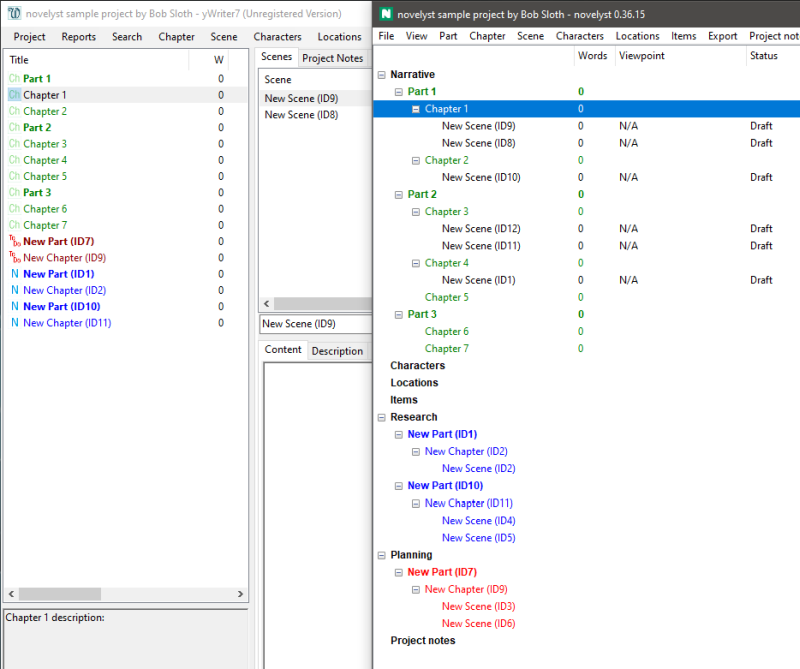

[Project home page](index) > Difference to yWriter

---

## What's the difference to yWriter?

When structuring a novel, *novelyst* builds on the concept of *yWriter*, and extends it in a compatible way. If the appropriate plugin is installed, *yWriter* can even be started with the current project from within the program. Here is a comparison with *yWriter* that illustrates the differences in presentation:

Please note that *novelyst* is not intended to compete with or replace *yWriter*. Quite deliberately, *novelyst* does not support many of *yWriter's* unique features. It has no scene editor included, no progress control, neither LaTeX nor ebook export. Definition and replacement of global variables and project variables is not supported, neither is inline code. Not to mention yWriter's sophisticated backup features. On the other hand, *novelyst* as a Python program can be used on operating systems other than Windows without any problems.

- Besides, in *novelyst* you can assign additional properties to the scenes, for example, the mode of discourse (*Narration*, *Dramatic action*, *Dialogue*, *Description*, or *Exposition*), or the [arcs](help/arcs), which offer a powerful concept to support plotting. 
- In addition to the *Action/Reaction* scheme, another custom scene category can be defined by the user. 
- The character data categories "Bio" and "Goals" can be renamed.
- *novelyst* can generate a scene's start date/time from the previous scene's end date/time.
- With *novelyst* you can set a document language for spell checking with *OpenOffice/LibreOffice*.
- *novelyst* preserves the markup for foreign language text passages as imported from *OpenOffice/LibreOffice*.
- The necessary data is stored along in the *.yw7* file, without breaking the compatibility to *yWriter*.

---

[Back](index)